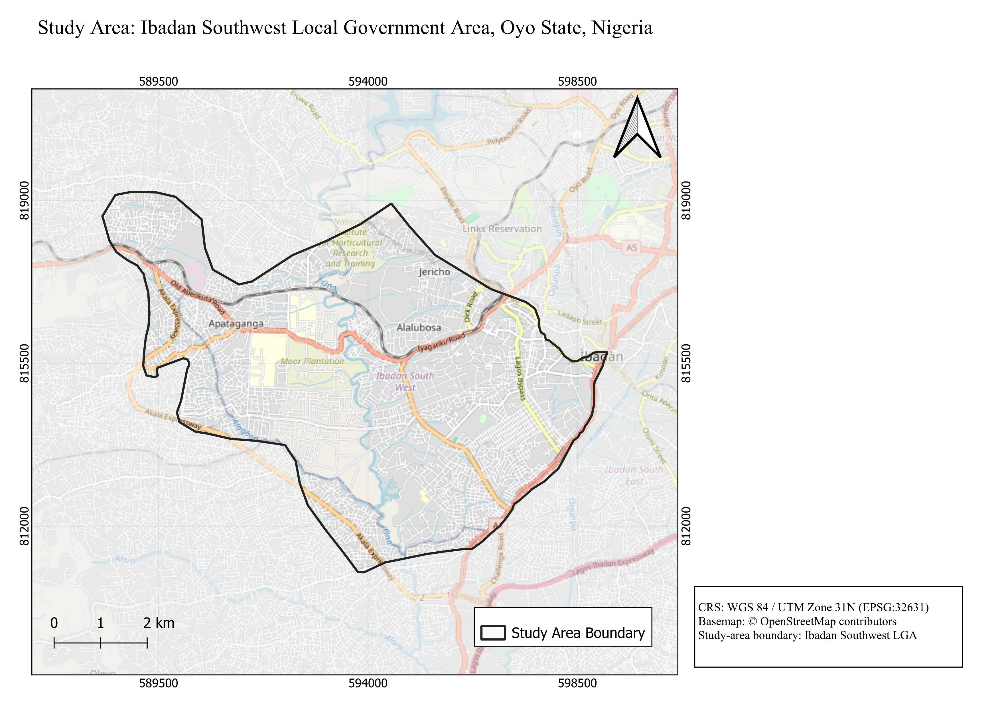
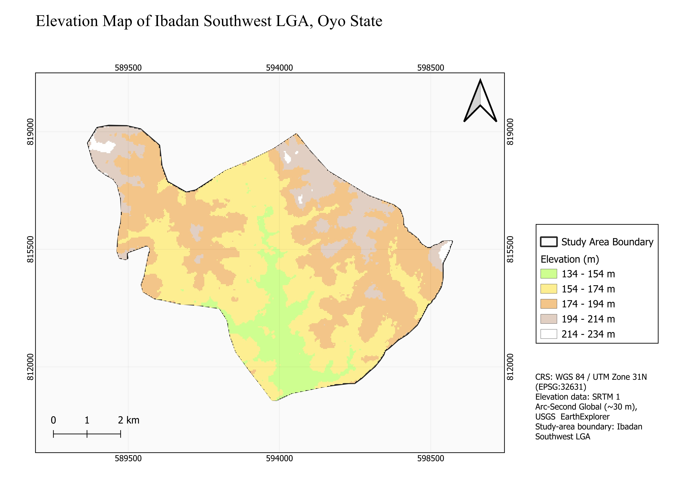
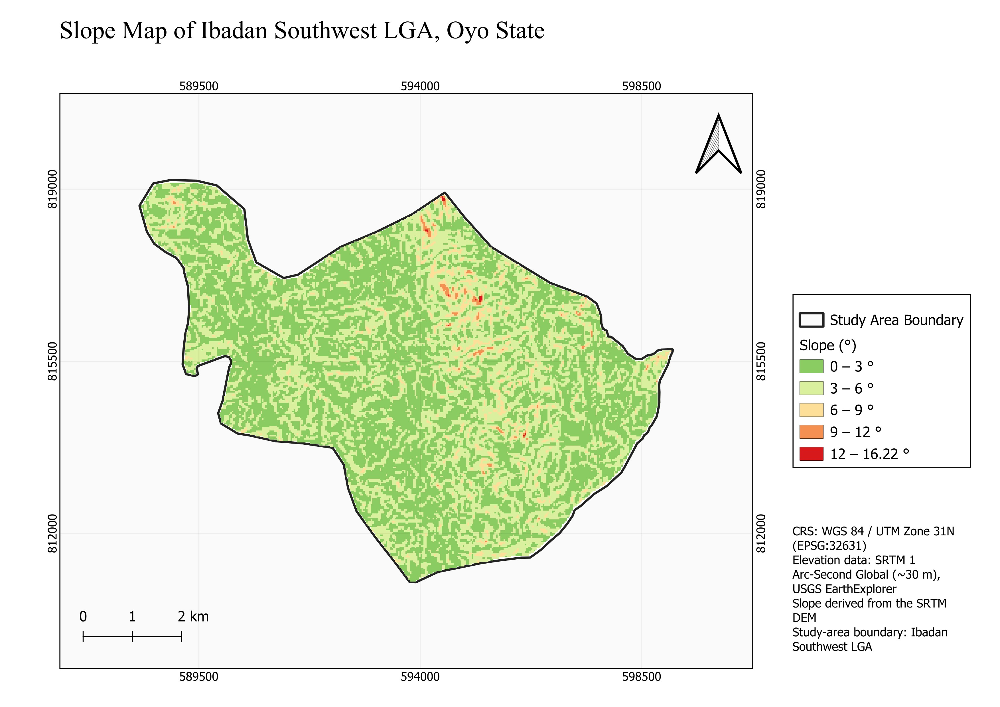
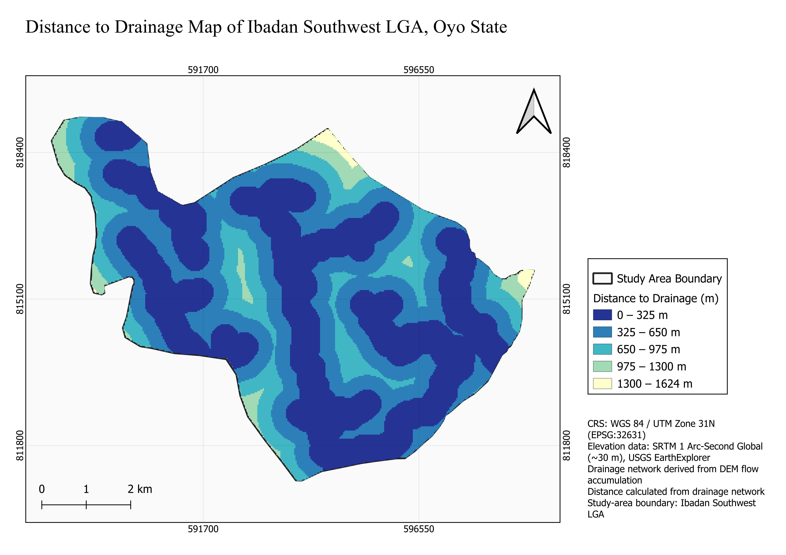
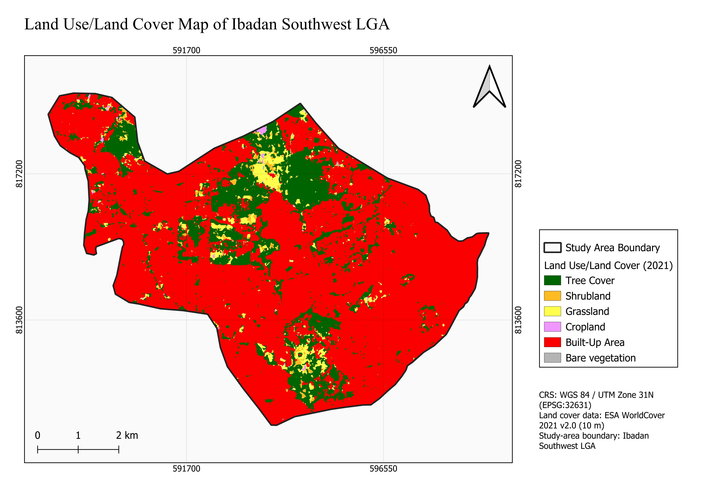
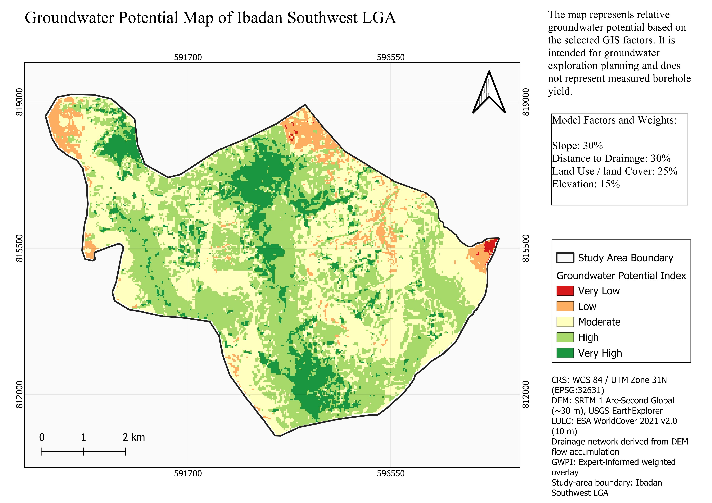

# Groundwater Potential Mapping of Ibadan Southwest LGA, Oyo State, Nigeria

## Project Overview

This project assesses the **relative groundwater potential of Ibadan Southwest Local Government Area, Oyo State, Nigeria**, using GIS-based multi-criteria analysis.

Four factors were combined using an expert-informed weighted overlay:

| Factor               | Weight |
| -------------------- | -----: |
| Slope                |    30% |
| Distance to drainage |    30% |
| Land use/land cover  |    25% |
| Elevation            |    15% |

The final **Groundwater Potential Index (GWPI)** ranges from approximately **1.30 to 5.00** and was classified into five relative potential classes: Very Low, Low, Moderate, High and Very High.

## Objectives

* Process geospatial data for groundwater potential assessment.
* Derive terrain and drainage factors from a DEM.
* Assess LULC and elevation as groundwater-related factors.
* Apply a weighted overlay to produce the GWPI.
* Produce maps for initial groundwater exploration planning.

## Study Area

The study covers **Ibadan Southwest Local Government Area, Oyo State, Nigeria**.

The main spatial analysis was carried out in **WGS 84 / UTM Zone 31N (EPSG:32631)**.

## Data

The main datasets used were:

* **SRTM 1 Arc-Second Global DEM (~30 m)** — USGS EarthExplorer
* **ESA WorldCover 2021 v2.0 (10 m)** — European Space Agency
* **CHIRPS annual rainfall (2001–2025)** — Climate Hazards Center, UCSB
* **Ibadan Southwest LGA boundary** — study-area boundary dataset

CHIRPS rainfall was investigated as a possible groundwater-related factor but was excluded from the final overlay because its spatial resolution was too coarse for the study area.

More details are available in [`DOCUMENTATION/Data_Sources.md`](DOCUMENTATION/Data_Sources.md).

## Methodology

The main processing steps were:

1. Reproject and clip the DEM to the study area.
2. Derive slope from the DEM.
3. Fill DEM sinks and generate flow accumulation.
4. Extract the drainage network and calculate distance to drainage.
5. Process and reclassify WorldCover LULC data.
6. Reclassify the four factors to a 1–5 suitability scale.
7. Apply the weighted overlay to generate the GWPI.
8. Classify the final index into five relative potential classes.

The detailed workflow is available in [`DOCUMENTATION/Methodology.md`](DOCUMENTATION/Methodology.md).

## Groundwater Potential Model

The final index was calculated as:

**GWPI = (Slope × 0.30) + (Distance to Drainage × 0.30) + (LULC × 0.25) + (Elevation × 0.15)**

The weights were **expert-informed for this portfolio assessment** and were not statistically calibrated against borehole-yield data.

## Results

The final GWPI ranges from approximately **1.30 to 5.00**.

The resulting map shows the relative groundwater potential across the study area based on the selected factors. It is intended to support **initial groundwater exploration and spatial planning**.

## Map Outputs

### Study Area



### Elevation



### Slope



### Distance to Drainage



### Land Use/Land Cover



### Groundwater Potential



## Limitations

This project estimates **relative groundwater potential**, not groundwater yield.

The model was not validated against spatial borehole-yield data, and the weights were expert-informed rather than statistically calibrated. Detailed geology, aquifer properties and borehole data were also not included in the final model.

The result should therefore be used as a **screening and exploration-planning tool**, not as a replacement for detailed hydrogeological investigation, geophysical surveys or borehole testing.

## Software

* QGIS 3.44.9
* GRASS GIS
* GDAL

## Project Structure

```text
Ibadan-Southwest-Groundwater-Potential-Mapping/
├── README.md
├── MAPS/
│   ├── 01_Study_Area_Map.jpeg
│   ├── 02_Elevation_Map.jpeg
│   ├── 03_Slope_Map.jpeg
│   ├── 04_Distance_to_Drainage_Map.jpeg
│   ├── 05_Land_Use_Land_Cover_Map.jpeg
│   └── 06_Groundwater_Potential_Map.jpeg
├── RASTERS/
│   └── Ibadan_Southwest_Groundwater_Potential_Index_v2.tif
└── DOCUMENTATION/
    ├── Methodology.md
    ├── Processing_Notes.md
    └── Data_Sources.md
```

## Author

**Ayomide Odunayo Agbede**
Hydrogeophysicist | GIS & Remote Sensing | Water Resources
Nigeria
